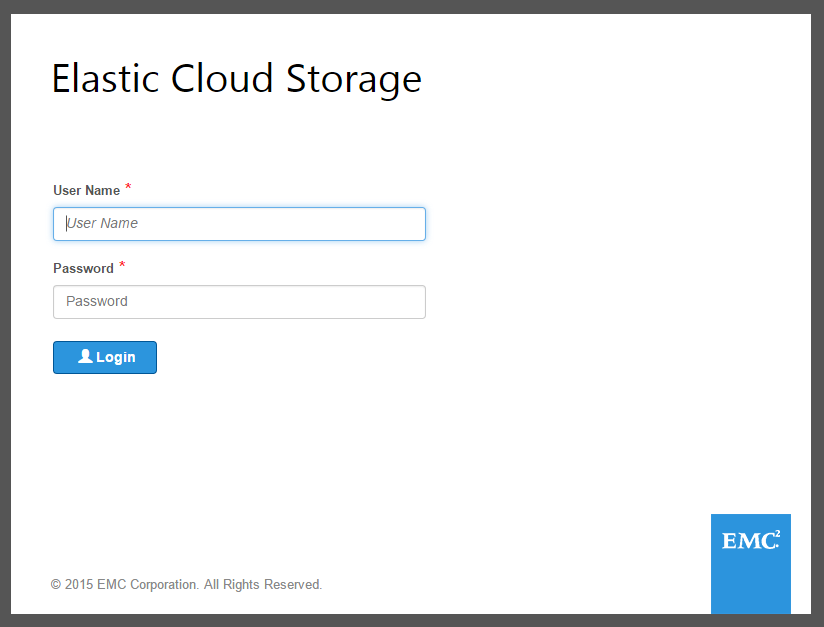

# Google Compute
We've provided the necesarry templates to install ECS Community Edition via Google Compute Engine Tools. This guide walks the user through this kind of installation.

## Prerequisite
Google Compute Engine Tools, you can download and install it from the following link:
- **[gcloud Tools Install](https://cloud.google.com/sdk/gcloud/ "gcloud Tool Guide")**

Deployment Manager is GCE's deployment orchestration tool. It enables developers/ops to describe deployments using templates so it is easier to consume, manage and deploy. The following is a deployment template that basically does the following;

1. Open required firewall ports for ECS
2. Create a new data disk of 256 GB size.
2. Create a new VM Instance of type n1-highmem-8 (8core 50GB)
3. Attach Disk
4. Assign Network
5. Run a startup script for installing and provisioning ECS.

We have included Google Compute Engine Template files that are located in this git repository.
## Single Node Template
Use the template found in ECS-CommunityEdition/ecs-single-node/gce/ to deploy single node ECS. Please make sure to reference the right template from ECS-CommunityEdition/ecs-single-node/gce/ecs_singlenode.yaml.
## Multi-Node Template
Use the template found in ECS-CommunityEdition/ecs-multi-node/gce/ to deploy multi-node ECS. Please make sure to reference the right template from ECS-CommunityEdition/ecs-multi-node/gce/ecs_singlenode.yaml.

## Deploy ECS with GCE Deployment Manager

Note I am using here a preemtible GCE node type, this means it lasts only 24 hours. If you are looking to run this for sometime remove this option from the template.

```
gcloud deployment-manager deployments create ecs-deployment --config ./ecs_singlenode.yaml
```

After the installation has completed the script will attempt to login using curl, this may take from 10 - 15 minutes.

## Provisioning
The automated provisioning may get stuck, login into the portal and start the manual provisioning. The license is already uploaded so you will need to just provision the following in order:

1. Create Storage Pool
2. Create Virtual Data Center
3. Create Replication Group
4. Create Namespace
4. Create User and retrieve S3 Secret Key
5. Create Bucket

[For details follow these steps in the ECS Portal.](https://github.com/EMCECS/ECS-CommunityEdition/blob/master/Documentation/ECS-UI-Web-Interface.md "ECS Manual Provisioning using ECS Web UI")


## Monitor Node Status
In order to monitor the installation process, you need to get a serial port dump from GCE, this can be done using the following command:

    gcloud compute instances get-serial-port-output --zone us-central1-f ecs1
    
    ## Access the ECS Web UI

 The ECS Administrative portal can be accessed from any one of the ECS data nodes via HTTPS on port 443. For example: https://ecs-node-ip-address. Once you see the screen below:




## Cleanup
Now once you are done, you can cleaup instance, disk and networks created (note the disk will be automatically deleted once the instance is deleted)

    gcloud deployment-manager deployments delete ecs-deployment
