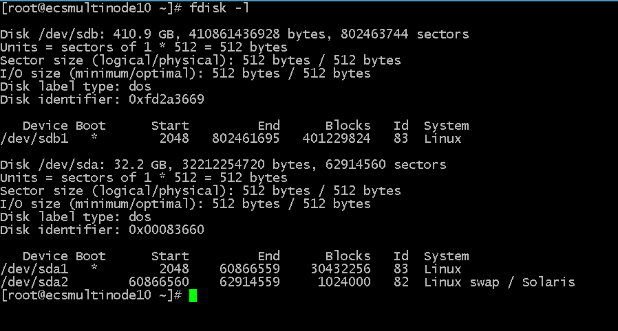
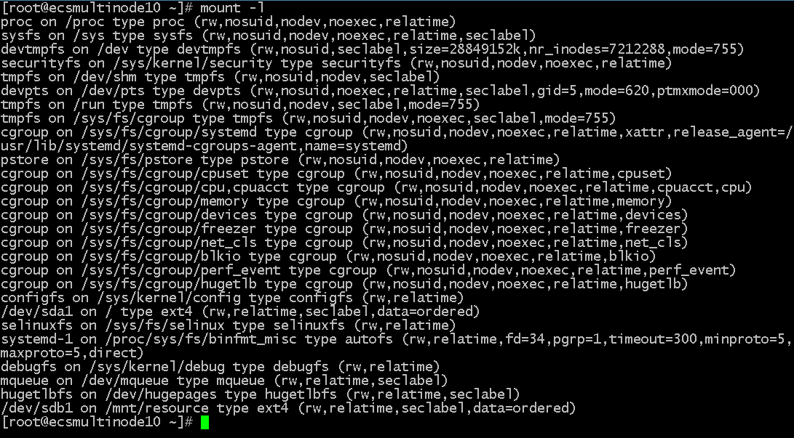
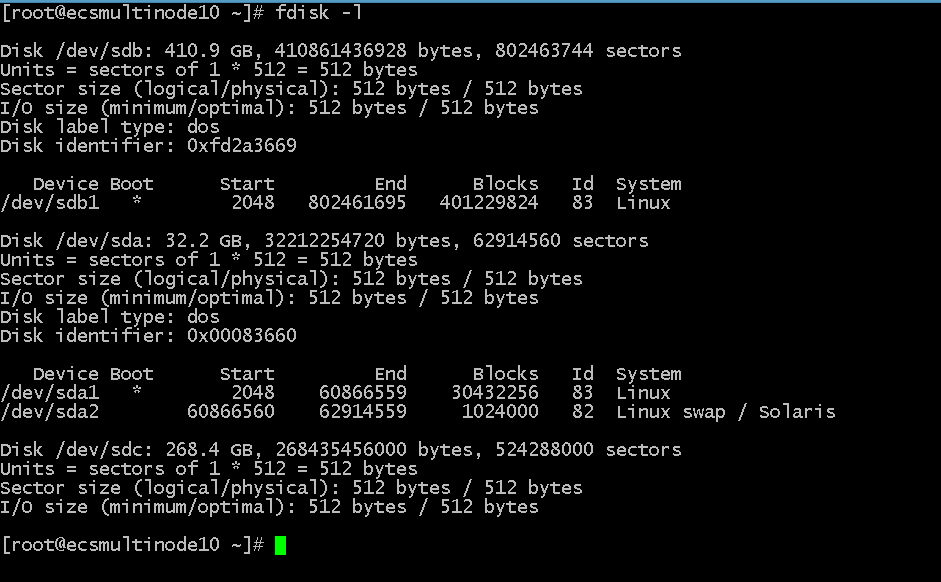
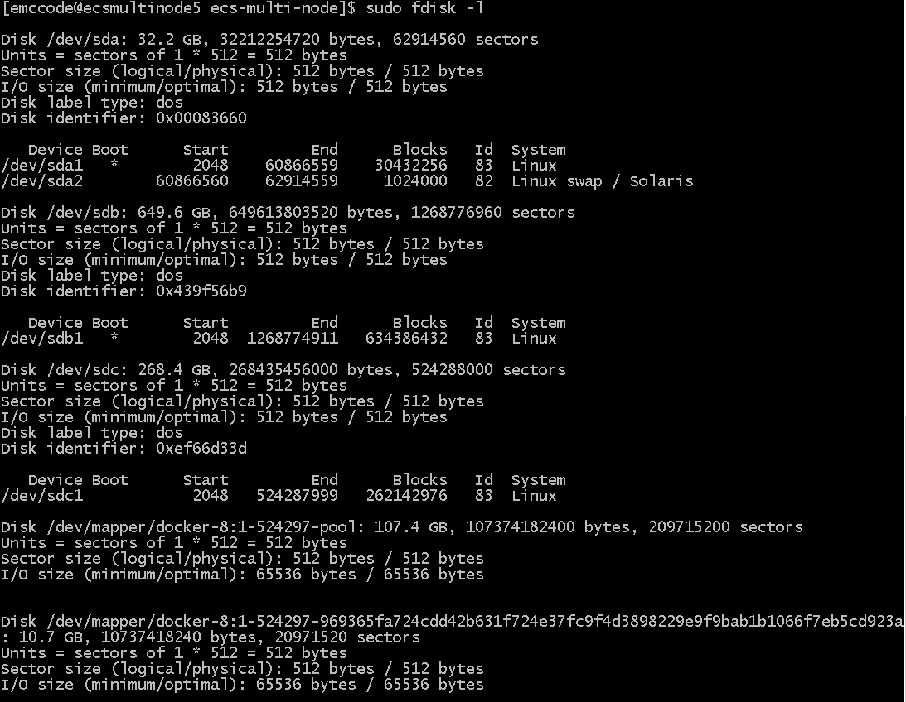

# Setting up the Environment

OS Name | Version | Docker Version |
|-------|---------|----------------|
|CentOS	| 7.1	    | 1.8.2 (latest) |

## Single Node Requirements 
* Operating System: CentOS 7.1
* CPU: 4 Cores
* Memory: Minimum 16GB RAM
* Disk: An un-partitioned/Raw disk with at least 100 GB of Storage per disk per host. Multiple disks can be attached on each ECS Node to increase capacity and performance. Each disk need to be un-partitioned before running the installation scripts.

## Multi-Node Requirements
An ECS cluster deployment requires a minimum of four data nodes to provide the full set of features. Each one of the instances should have the following minimum requirements:
* Operating System: CentOS 7.1
* CPU: 4 Cores
* Memory: Minimum 16GB RAM
* Disk: An un-partitioned/Raw disk with at least 100 GB of Storage per disk per host. Multiple disks can be attached on each ECS Node to increase capacity and performance. Each disk need to be un-partitioned before running the installation scripts.

## Using a Public Cloud Service
ECS can be easily installed on any public cloud service such as Google Computer, Amazon EC2, Microsoft Azure, etc. Simply create the above required resources and follow the installation guide. However, ***make sure that the appropriate ports are open externally.*** Default open ports will change from provider to provider. ***Even though the correct ports are open on your VM they may be closed by the provider.***

## Attach Data Disk(s)
These steps are to be performed prior running the installation scripts on each of the ECS Nodes:

1. **Attach Data Disk(s):** ECS requires one or more disks to be attached to each host. The disk(s) will hold the object data store. **The Disks will be formatted as XFS by the installation script.**

The data disk(s) attached to each host need to be **unpartitioned or RAW**. For example: We have a new host where we execute the command `sudo fdisk -l`:

In the picture, we can see two disks: **sda** and **sdb**. A `mount -l` looks like this: 

Now we attach a new disk to the host VM. The new disk **/dev/sdc** looks like this after executing `fdisk -l` again:

**Note:** Depending on the environment or the cloud provider you maybe using, the attached disk name(s) will be different. In this example, the attached disk came as **/dev/sdc**. The attached disk will be formatted and mounted during step 1, so do not mount the ECS data disk before executing step 1:

## Required Ports
2. **Open Ports:** ECS requires the following ports to be open:

|Port Number|Port Description|
|-----------|----------------|
|22| SSH, needed if using remote access |
|443 | Port used for accessing the ECS management website|
|3218| Port used by the CAS service|
|4443| ECS management API port |
|9020| Port used for the S3 API|
|9021| Port used for the S3 API on HTTPS|
|9022| Port used for Atmos API|
|9023| Port used for Atmos API on HTTPS|
|9024| Port used for SWIFT API |
|9025| Port used for SWIFT API on HTTPS|
|9100| Port used for DT Query service|
|9101| ECS Diagnostic Service Index |

## Network Configuration
3. **Network configuration:** Define your network configuration. In the case of multiple nodes, all ECS Data Nodes must be on the same subnet and be able to talk to each other. This is an example:

## Install ECS-CE
Now that the correct resources are available you're ready to install ECS. Simply follow the correct installation documentation and you'll be up and running in no time.
